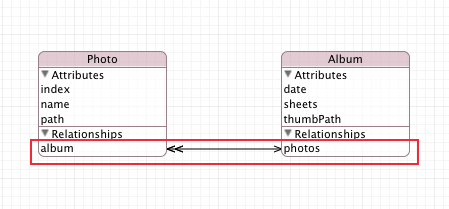
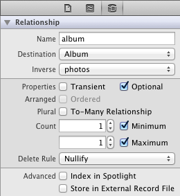
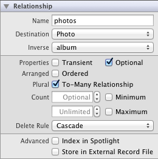

#Core Data Relationship and Relationship Delete Rules
If your data model is complex,you could need to set Core Data Relationship,   

Take my App "FrozenTime" for example,It need to set two entity(Album and Photo).  

Album and Photo is One-to-Many Relationships.

The red rectangle area is the "One-to-Many Relationships" look like.  



We also need to set each album and photo in Utilities tab.  

Before we do that,you should read Relationship Delete Rules from Apple document.

###Relationship Delete Rules

A relationship's delete rule specifies what should happen if an attempt is made to delete the source object. Note the phrasing in the previous sentence—"if an attempt is made…". If a relationship's delete rule is set to Deny, it is possible that the source object will not be deleted. Consider again a department's employees relationship, and the effect that the different delete rules have.

**Deny**  
If there is at least one object at the relationship destination, then the source object cannot be deleted.  
For example, if you want to remove a department, you must ensure that all the employees in that department are first transferred elsewhere (or fired!) otherwise the department cannot be deleted.  

**Nullify**  
Set the inverse relationship for objects at the destination to null.  
For example, if you delete a department, set the department for all the current members to null. This only makes sense if the department relationship for an employee is optional, or if you ensure that you set a new department for each of the employees before the next save operation.  

**Cascade**  
Delete the objects at the destination of the relationship.  
For example, if you delete a department, fire all the employees in that department at the same time.  

**No Action**  
Do nothing to the object at the destination of the relationship.  
For example, if you delete a department, leave all the employees as they are, even if they still believe they belong to that department.  

Reference:
<https://developer.apple.com/library/mac/#documentation/Cocoa/Conceptual/CoreData/Articles/cdRelationships.html>

###Set Album and Photo entity

Click Photo entity relationships tag "album",set it as below pic.  


Click Album entity relationships tag "photos",set it as below pic.  


###Save Album and Photo Entity  

```objc  
//Image File Name
NSString *ImageFileName=[NSString stringWithFormat:@"%04i",receiveIndex];
    
//Create Photo Entity
Photo *currentPhoto=[[Photo alloc]
                     initWithEntity:[NSEntityDescription entityForName:@"Photo" inManagedObjectContext:self.managedObjectContext]  
                     insertIntoManagedObjectContext:self.managedObjectContext];
//Set Current Photo
[currentPhoto setIndex:[NSNumber numberWithInt:0]];

[currentPhoto setName:ImageFileName];
    
NSString *projectFolder=[NSString stringWithFormat:@"%d", albumIndex];
NSString *saveProjectPath=[HanpoFileHelper creatFolder:projectFolder];
[currentPhoto setPath:saveProjectPath];
    
//Add Current Photo to Current Album 
[currentAlbum addPhotosObject:currentPhoto];
    
//Set Number of Sheets to Current Album
[currentAlbum setSheets:[NSNumber numberWithInteger:sheets]];
    
//Save File to Core Data
NSError *savingError;
if (![self.managedObjectContext save:&savingError])NSLog(@"Error saving: %@", savingError);
```

Load from Core Data and Get Image
//Get Core Data(TableView didSelectRowAtIndexPath)
NSManagedObject *object = [self.fetchedResultsController objectAtIndexPath:indexPath];
Album *album=(Album*)object;
    
//Get All Photos Entity
NSArray *photosArray=[album.photos allObjects];
    
//Sort Photo Entity by Name
NSSortDescriptor *nameDescriptor =[[NSSortDescriptor alloc] initWithKey:@"name" ascending:YES];
NSArray * descriptors =[NSArray arrayWithObjects:nameDescriptor, nil];
NSArray *sortedPhotoArray=[photosArray sortedArrayUsingDescriptors:descriptors];
NSInteger countSortedPhotoArray=[sortedPhotoArray count];

//Put Image into array or do other things
NSMutableArray *imgArray=[[NSMutableArray alloc]init];
int i;
for (i=0; i<countSortedPhotoArray; i++) {
    Photo *tempPhoto=[sortedPhotoArray objectAtIndex:i];
    NSString *name=tempPhoto.name;
    NSString *path=tempPhoto.path;
    NSString *fileName=[name stringByAppendingString:@".jpg"];
    NSString *fullPath=[path stringByAppendingPathComponent:fileName];
    UIImage *image=[UIImage imageWithContentsOfFile:fullPath];
    [imgArray addObject:image];
}


Delete Album and Photo
In tableview method

- (void)controller:(NSFetchedResultsController *)controller didChangeObject:(id)anObject
atIndexPath:(NSIndexPath *)indexPath forChangeType:(NSFetchedResultsChangeType)type
newIndexPath:(NSIndexPath *)newIndexPath

To delete album and photos just need to write this.
[tableView deleteRowsAtIndexPaths:[NSArray arrayWithObject:indexPath] withRowAnimation:UITableViewRowAnimationFade];
If you set right delete rule in your entity(Here's Cascade).

When you delete album,all photos in that album will also delete.